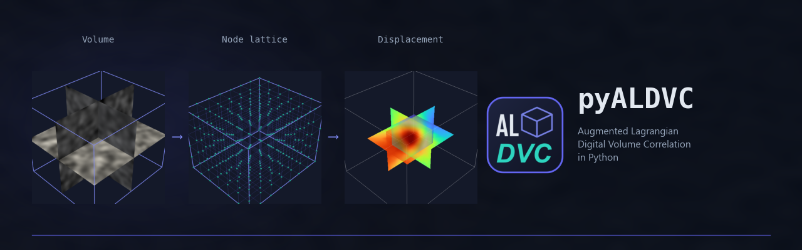
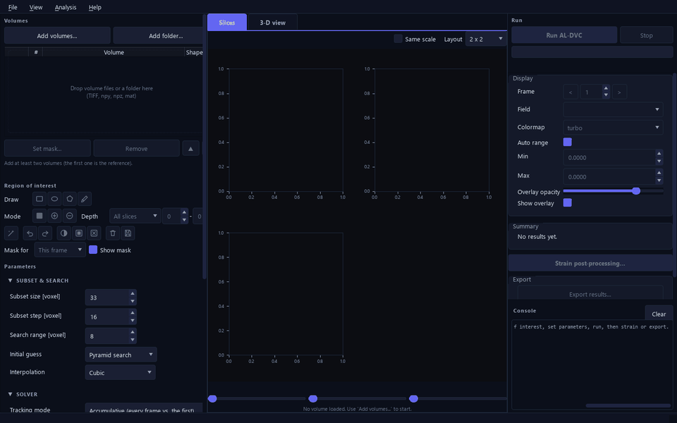
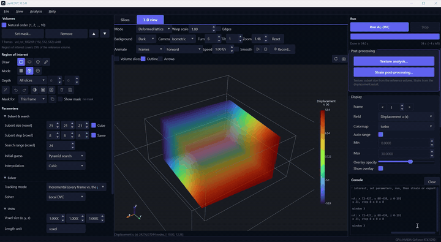
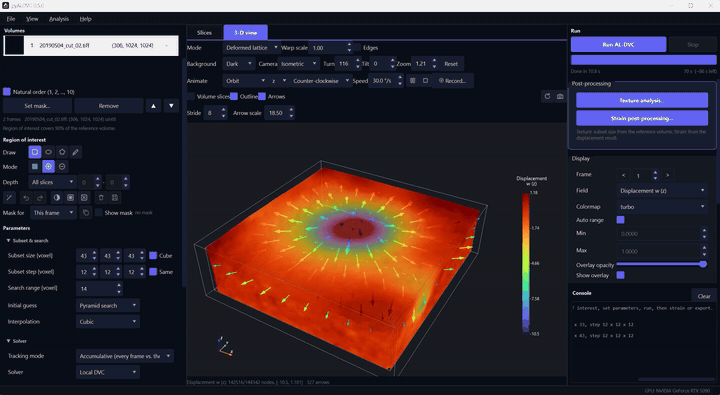
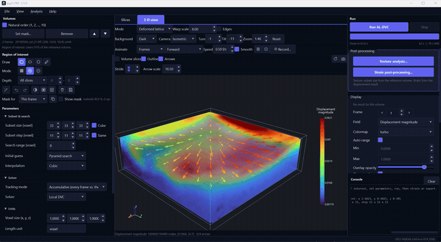
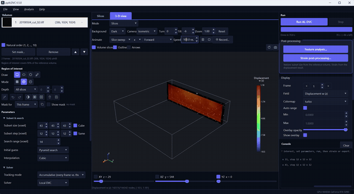
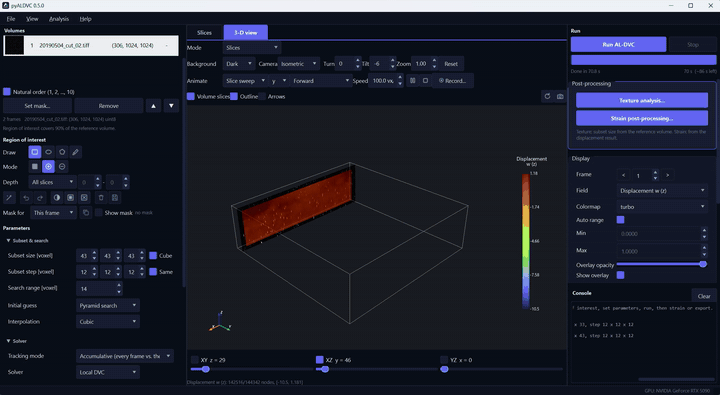
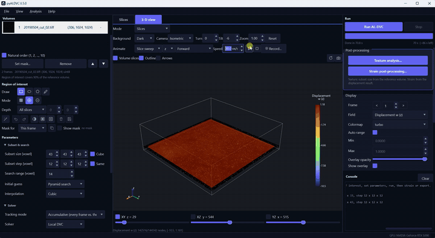

<p align="center">
  
</p>

<p align="center">
  Full-field 3-D displacement and strain from volumetric images (micro-CT, confocal, MRI, OCT).
</p>

<p align="center">
  <a href="https://github.com/zachtong/pyALDVC/actions/workflows/ci.yml"></a>
  
  
  
  
  <a href="https://pypi.org/project/al-dvc/"></a>
</p>

<p align="center">
  <strong>Available in 7 languages</strong><br/>
  
  
  
  
  
  
  
</p>

---

pyALDVC is the Python version of the MATLAB [ALDVC](https://github.com/FranckLab/ALDVC)
code (Yang, Hazlett, Landauer, Franck, *Exp. Mech.* 2020) and the volumetric sibling of
[pyALDIC](https://github.com/zachtong/pyALDIC): a desktop application that turns a
sequence of 3-D scans into displacement and strain fields.

<p align="center">
  
</p>

## Why pyALDVC

- **Accurate where subset DVC breaks down.** Local subsets are coupled to a global smoothness step, so steep gradients, boundaries and noisy scans stay sub-voxel accurate.
- **Fast.** A 1024 x 1024 x 306 micro-CT scan with 79 200 nodes takes 23 s on an NVIDIA GPU, 3.6 min on a 24-core CPU.
- **Point and click.** Load the scans, draw the region of interest on the slices, run, look, export. No code.
- **Knows your data.** The texture analysis measures your scan and suggests the subset size and step.
- **See it in 3-D.** Field slices, the deformed lattice, displacement arrows; animations recorded as GIF or MP4.
- **Strain included.** Four gradient methods and four strain measures, computed after the run in their own window.
- **Every format.** TIFF, MATLAB, NumPy, HDF5, NIfTI, NRRD, DICOM in; NumPy, MATLAB, CSV, ParaView and a PDF report out.

## Case studies

**Synthetic rotation**

<p align="center">
  
</p>

**Hydrogel indentation, micro-CT, 306 x 1024 x 1024 voxels**

<p align="center">
  
</p>
<p align="center">
  
</p>
<p align="center">
  
</p>
<p align="center">
  
</p>
<p align="center">
  
</p>

## Install

```bash
pip install al-dvc            # add "[gpu]" for the NVIDIA backend
al-dvc-gui
```

No Python? Every [release](https://github.com/zachtong/pyALDVC/releases) ships a portable Windows bundle: unzip, double-click `pyALDVC.exe`.

Read the [user guide](docs/user_guide.md) to get started.

## Citation

> J. Yang, L. Hazlett, A. K. Landauer, C. Franck. Augmented Lagrangian
> Digital Volume Correlation (ALDVC). *Experimental Mechanics* 60, 1205-1223
> (2020). https://doi.org/10.1007/s11340-020-00607-3

## License

BSD 3-Clause. Developed in Dr. Jin Yang's group at The University of Texas
at Austin.
