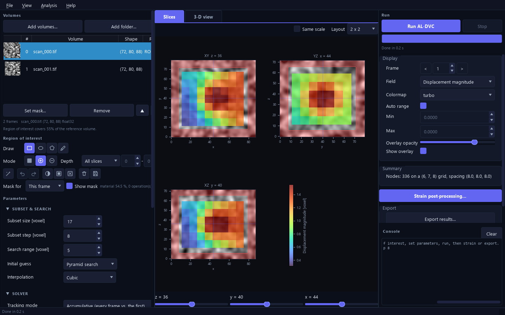
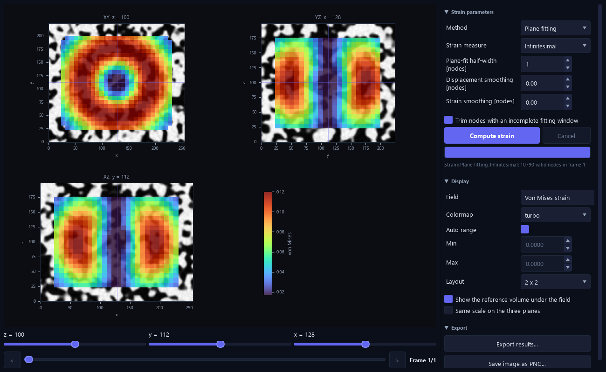
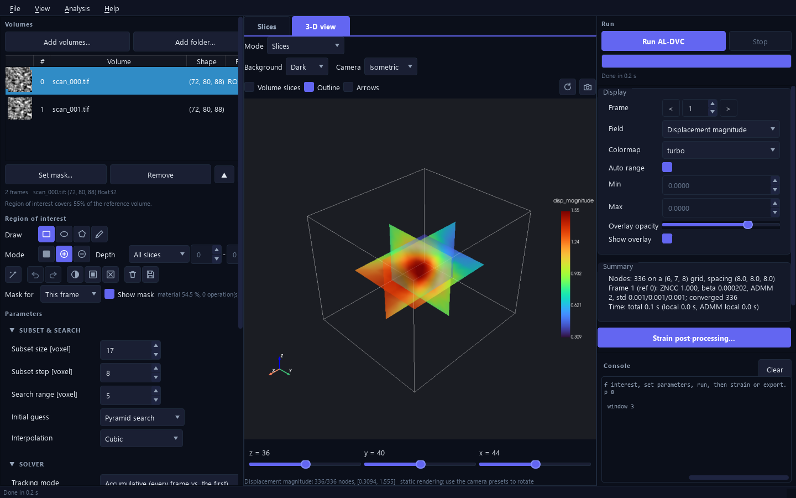

<p align="center">
  
</p>

<p align="center">
  Full-field 3-D displacement and strain from volumetric images (micro-CT, confocal, MRI, OCT)<br/>
  with a hybrid local-global solver, GPU acceleration and a complete desktop application.
</p>

<p align="center">
  <a href="https://github.com/zachtong/pyALDVC/actions/workflows/ci.yml"></a>
  
  
  
  
  <a href="https://pypi.org/project/al-dvc/"></a>
</p>

<p align="center">
  <strong>Available in 7 languages</strong><br/>
  
  
  
  
  
  
  
</p>

---

## Why pyALDVC?

Subset-based DVC (IC-GN) solves every node on its own: accurate for small
deformations, fragile where the field is steep, near boundaries and in noisy
scans. pyALDVC couples the local 12-DOF subsets to a global finite-element
compatibility step through the **Augmented Lagrangian (ADMM)** framework, so the
field is smoother and more accurate while keeping sub-voxel precision.

pyALDVC is the Python re-implementation of the MATLAB
[ALDVC](https://github.com/FranckLab/ALDVC) code (Yang, Hazlett, Landauer,
Franck, *Exp. Mech.* 2020) and the volumetric sibling of
[pyALDIC](https://github.com/zachtong/pyALDIC). It keeps the algorithm and adds
the engineering: masks and regions of interest, a coarse-to-fine initial guess,
Numba and CUDA kernels, streaming I/O, ParaView export, tests against analytic
ground truth, a command line and a desktop application.

---

## Key features

### Desktop application

Three columns like pyALDIC: volumes, region of interest and parameters on the
left, the slice viewer and the 3-D view in the middle, run controls, results,
exports and the console on the right. Load volumes, draw or auto-segment the
region of interest, set parameters, run, inspect, export: no code needed.
Before a run the slices preview the node lattice and one subset for the
current subset size and step (hover a node to see its subset); the subset
can be cubic or set per axis.

<p align="center">
  
</p>

<p align="center"><sub>Synthetic open-cell foam (200 x 224 x 256 voxels) under compression with a localised vortex;
the displacement magnitude forms a torus. Subset 24, step 8, 14 112 nodes, 11 s on an RTX 5090.
Regenerate every asset with <code>python scripts/make_branding.py</code>.</sub></p>

<p align="center">
  
</p>

### Local DVC or AL-DVC

Run independent subsets (local DVC) or the full ADMM global-local coupling
(AL-DVC) with one switch; same window, same workflow. The penalty `beta` is
tuned automatically with an L-curve.

### Strain post-processing and 3-D view

Strain is a post-processing step with its own window: plane fitting, finite
elements, finite differences or the solver's gradient; infinitesimal,
Green-Lagrange, Euler-Almansi or Hencky measures; smoothing and edge trimming.
The 3-D view shows field slices, node points, iso-surfaces, the deformed
lattice and displacement arrows. Its camera row (azimuth, elevation, zoom) follows
the mouse, and the animation row plays an orbit about any axis, a frame sequence,
a slice sweep or a growing warp, at a chosen speed and direction; Record writes
the animation as GIF, MP4 or PNG frames.

<p align="center">
  
  
</p>

### Texture analysis before the run

How big should the subset be? The texture analysis window (Post-processing box or
Analysis menu) computes
the autocorrelation of the reference volume inside the region of interest, reports
the correlation lengths along x, y and z and over spherical shells, checks how
stable they are against the sampled volume, and suggests a subset and step per
axis that one click writes into the parameters. The same numbers come from
`al-dvc texture VOLUME` on the command line.

### Fast on a laptop, faster on a GPU

Numba kernels read subsets in place (about 21 bytes per voxel resident, 9 with
on-the-fly gradients); with `pip install "al-dvc[gpu]"` the local solvers run as
CUDA kernels compiled for the installed NVIDIA card. The micro-CT example of the
MATLAB code (1024 x 1024 x 306 voxels, 79 200 nodes) takes 23 s on an RTX 5090
and 3.6 min on a 24-core CPU, with results within 0.01 voxel of MATLAB.

---

## Highlights

| | |
|---|---|
| **Algorithm** | 12-DOF local IC-GN (ZNSSD, tricubic / B-spline / trilinear sampling) + hex8 FEM or finite-difference global step + ADMM with automatic L-curve tuning of the penalty `beta` |
| **Initial guess** | global phase-correlation pre-shift, coarse-to-fine pyramid NCC with automatic search-radius expansion, universal-median outlier test, harmonic inpainting |
| **Robustness** | boolean masks on the reference and on the deformed frame (masked subsets, trimmed elements), per-node status codes, stall detection, low-texture rejection, Gaussian pre-smoothing for low-SNR data, partial results on cancel |
| **Uncertainty** | per-node standard deviation of u, v, w from the IC-GN normal equations (`U_std`, exported as `disp_std_*`), calibrated on synthetic noise (`reports/uncertainty.pdf`) |
| **Performance** | Numba `prange` kernels that read subsets in place (no per-node subset cache: 21 bytes per voxel, 9 with `gradient_mode="on_the_fly"`); scalar global operator assembled once, solved by PCG for all three components |
| **Tracking** | accumulative, incremental or any reference-frame schedule; cumulative displacement composition; per-frame checkpoints and resume |
| **Strain** | plane fit (3D Savitzky-Golay), FEM nodal, finite difference or direct ADMM gradient; infinitesimal, Green-Lagrange, Euler-Almansi, Hencky; principal / von Mises / volumetric / rotation; physical voxel sizes |
| **I/O** | TIFF stacks, slice folders (TIFF / PNG / BMP / JPEG, colour to luminance), MATLAB `.mat` (v5/v7.3, MATLAB axis order handled), NumPy, HDF5; NIfTI, NRRD and DICOM series through the optional `nibabel`, `pynrrd`, `pydicom`; exports to `.npz`, `.mat`, CSV, VTK `.vti` (+ `.pvd` time series), slice images and a PDF report |

## Installation

Two flavours, nothing else to pick:

```bash
pip install al-dvc           # CPU: the complete application (GUI, 3-D view, CLI)
pip install "al-dvc[gpu]"    # the same plus the CUDA backend for NVIDIA GPUs
```

From a clone of this repository use `pip install -e .` or `pip install -e ".[gpu]"`.
Requires Python >= 3.10; NumPy, SciPy, Numba, tifffile, h5py, matplotlib,
PyYAML, PySide6, pyvista and pyvistaqt are installed automatically. The Numba kernels compile
on first use (~10 s) and are cached on disk; call `al_dvc.warmup()` at
application start to hide this.

## Quick start

### Python

```python
import numpy as np
from al_dvc import dvcpara_default, run_aldvc, load_volume
from al_dvc.export import export_npz, export_vtk, export_report

ref = load_volume("ref.tif")           # (nz, ny, nx) array, any dtype
dfm = load_volume("deformed.tif")

para = dvcpara_default(
    winsize=32,            # subset size (voxels, per axis or scalar)
    winstepsize=16,        # node spacing
    voxel_size=(5.0, 5.0, 5.0), units="um",
)
result = run_aldvc(para, [ref, dfm])

mesh = result.dvc_mesh                  # node coordinates (N, 3) = [x, y, z], grid_shape (nz, ny, nx)
U = result.result_disp[0].U             # (N, 3) displacement in voxels
U_std = result.result_disp[0].U_std     # (N, 3) per-node standard deviation (voxels), NaN where not converged
E = result.result_strain[0]             # exx, eyy, ezz, exy, exz, eyz, principal, von_mises, ...
exx_grid = mesh.to_grid(E.field("exx")) # (nz, ny, nx) grid, NaN where unreliable

export_npz(result, "out/result.npz")
export_vtk(result, "out/vtk")           # open out/vtk/aldvc.pvd in ParaView
export_report(result, "out/report.pdf")
```

Masks (boolean volumes, `True` = material, one per frame) and multi-frame
sequences. A frame's mask trims the reference subsets when the frame is the
reference and, when it is the deformed frame, removes the voxels that the
warped subsets would sample from it (a void that opens, a region that
leaves the field of view):

```python
result = run_aldvc(para, [ref, f1, f2, f3], masks=[mask0, mask1, mask2, mask3])
para_inc = dvcpara_default(winsize=32, winstepsize=16, reference_mode="incremental")
```

Long sequences can be checkpointed frame by frame and resumed after an
interruption (`al-dvc run --checkpoint DIR`, or the `checkpoint` config key):

```python
result = run_aldvc(para, provider, checkpoint_dir="scan/checkpoints")  # reuses finished frames on rerun
```

Large sequences stream from disk with a bounded cache:

```python
from al_dvc.io import FileVolumeProvider
provider = FileVolumeProvider(sorted(Path("scan").glob("*.tif")), voi=para.voi)
result = run_aldvc(para, provider)
```

### Graphical application

```bash
al-dvc-gui                 # or: al-dvc gui [session.aldvc]
```

A standalone PySide6 window (`al_dvc.gui`, layout and architecture shared with
pyALDIC): volumes and parameters on the left (folding sections, inputs that
only react to the wheel when focused), the slice viewer in the middle, run
controls, results, exports and the console on the right. The workflow is
load, draw the region of interest, set parameters, run, export: results stay
in memory and each export asks where to write; the analysed box is the
bounding box of the drawn region grown by the subset half-width and the search
range (memory and time scale with the region, not with the scan). Mask drawing
(rectangle / ellipse / polygon / brush on any slice, extruded
through all slices, one slice or a range; add / cut; undo; `reports/mask_tools.pdf`), a
3-D view (pyvista: field slices with their own position controls, node points,
iso-surface, warped lattice, displacement arrows, volume slices, selectable
background, camera controls, orbit / frames / slice / warp animations recorded
as GIF, MP4 or PNG; `reports/view3d.pdf`), a strain post-processing window (method,
measure, smoothing chosen after the run, computed on demand; Ctrl+T) and an
export dialog (npz, mat, CSV, ParaView, PDF report, slice images; Ctrl+E),
and a batch dialog that runs several saved sessions one after another
(`File > Batch run...`, the same as `al-dvc batch`; `reports/batch.pdf`). Sessions (`.aldvc`) keep volumes, parameters, export
folder and display state; checkpoints (resume after an interruption) are an
advanced option, and a checkpoint folder left by a different run is replaced; `Help > Run self-test` (or `al-dvc-gui --self-test`)
checks an installation. Seven languages (English, Simplified and Traditional
Chinese, Japanese, German, French, Spanish; `View > Language`, or the system
locale); `tools/i18n_extract.py` audits the tables against the code. The
kernels compile in the background after the window opens. `reports/gui.pdf` shows the screens.

**Without Python (Windows):** every release also ships a portable bundle
`pyALDVC-<version>-win64.zip` on the
[releases page](https://github.com/zachtong/pyALDVC/releases). Unzip it
anywhere and double-click `pyALDVC.exe`; `pyALDVC-console.exe --self-test`
writes an installation report. The bundle is built by `tools/build_exe.py`
(PyInstaller, `packaging/pyaldvc.spec`) and checked by
`tests/test_frozen_bundle.py` before it is attached to the release.

### Command line

```bash
al-dvc synth data/synth --shape 96 96 96 --mode stretch --value 0.02   # synthetic test pair
al-dvc run --volumes data/synth -o results --winsize 24 --step 12 --export npz vtk report
al-dvc run config.yaml                                                 # see examples/scripting/
al-dvc plot results/aldvc.npz --field exx --frame 1
al-dvc batch study/*.aldvc --export npz summary report              # sessions saved by the GUI, one after another
al-dvc info scan/*.tif
```

### GPU acceleration (optional)

```bash
pip install "al-dvc[gpu]"          # numba-cuda with the CUDA 12 wheels; needs an NVIDIA driver
```

With an NVIDIA GPU the local solvers (Hessian precompute, 12-DOF IC-GN, the
3-DOF ADMM passes) run as CUDA kernels compiled at first use for the installed
card (any compute capability the CUDA 12 toolchain supports, Maxwell and
newer; the RTX 5090 included). Results agree with the CPU kernels to about
1e-5 voxel (float32 sampling, float64 solves); the local steps are 25-40x
faster on an RTX 5090 than on a 24-core CPU. Installations without the `gpu` flavour,
without a driver or without a usable device are unaffected: `backend="auto"`
(the default) probes CUDA once and uses the CPU kernels otherwise, and the GUI
shows which backend it picked. The portable Windows bundle is CPU-only.

## How it works

For a reference volume `f` and a deformed volume `g` the pipeline solves,
on a regular grid of nodes:

1. **Initial guess** -- global rigid shift by phase correlation, then a
   coarse-to-fine normalised cross-correlation pyramid per node
   (sub-voxel peak fit, quality factors, outlier removal, inpainting).
2. **Local step (subproblem 1)** -- at every node an affine subset warp
   (9 gradient + 3 translation parameters) is fitted by IC-GN on the ZNSSD
   criterion. Later ADMM passes hold the gradient at the global estimate and
   fit only the 3 translations with a proximal penalty.
3. **Global step (subproblem 2)** -- a kinematically compatible field
   `u_hat` minimises `beta/2 |grad(u_hat) - (F - W)|^2 + mu/2 |u_hat - (u - v)|^2`
   over the hex8 FEM (or finite-difference) discretisation. `beta` is tuned
   automatically by an L-curve sweep on the first frame of each reference.
4. **ADMM iterations** alternate 2 and 3 with scaled dual updates until the
   RMS displacement update drops below `admm_tol` (typically 2-4 steps).
5. **Strain** from the cumulative displacement in physical units.

Every convention (axis order, node ordering, DOF layout, warp parameters)
is fixed in [`docs/design.md`](docs/design.md), which also records the
design decisions and the differences from the MATLAB code.

## Parameters

`dvcpara_default(**overrides)` returns a validated, immutable `DVCPara`.
The most useful fields:

| field | default | meaning |
|---|---|---|
| `winsize`, `winstepsize` | 32, 16 | subset size and node spacing (voxels; scalar or `(x, y, z)`) |
| `voi` | whole volume | `VOIRange(x=(lo, hi), y=..., z=...)` inclusive voxel ranges |
| `voxel_size`, `units` | 1, "voxel" | physical scale for exported displacements and strains |
| `init_guess_method` | `"pyramid"` | `pyramid` / `ncc` / `zero` / `previous` |
| `search_radius` | 8 | NCC search half-width (coarsest pyramid level); expands automatically for clipped peaks |
| `init_subset` | None (= min(winsize, 16)) | NCC template size |
| `interp_method` | `"cubic"` | `cubic` (Keys, = MATLAB `ba_interp3`) / `bspline` / `linear` |
| `icgn_tol`, `icgn_max_iter` | 1e-2, 100 | IC-GN relative gradient-norm tolerance (MATLAB criterion) and iteration cap |
| `icgn_dp_tol` | 1e-3 | IC-GN parameter-increment tolerance in voxels (gradient terms scaled by `winsize/2`) |
| `icgn_patience` | 5 | give up on a node after this many iterations without improvement (status `stalled`); 0 disables |
| `use_global_step` | True | False = plain local subset DVC |
| `mu`, `beta` | 1e-3, auto | ADMM penalties (`beta=None` triggers the L-curve sweep) |
| `beta_criterion` | `"matlab"` | L-curve score: `matlab` (`|u-u_hat| + h^2 |F-grad u_hat|`, MATLAB rule) or `normalized` |
| `admm_max_iter`, `admm_tol` | 4, 1e-2 | ADMM iterations / stopping (voxels) |
| `subpb2_method` | `"fem"` | `fem` or `fd` global discretisation |
| `dual_update` | `"accumulate"` | standard scaled ADMM; `reset` reproduces the MATLAB FEM path |
| `prefilter_sigma` | 0 | Gaussian pre-smoothing of every volume (helps low-SNR data) |
| `strain_method` | `"plane_fit"` | `plane_fit` / `fem` / `fd` / `direct` |
| `strain_plane_fit_halfwidth` | 1 | plane-fit window half-width in nodes |
| `strain_type` | `"infinitesimal"` | `green_lagrange`, `euler_almansi`, `hencky` |
| `reference_mode` | `"accumulative"` | or `"incremental"`; `frame_schedule` for custom trees |
| `subset_stride` | 1 | sample every k-th subset voxel per axis: k^3 fewer voxels per IC-GN iteration (local steps 5x faster at k = 2 with subset 32), the same result on clean data, about 3x the noise-induced error (a subset with k^3 fewer voxels), the smoothing bias of the full span; 2 is a good choice for subsets of 32 and more on data with a decent SNR |
| `init_coarse_factor` | 1 | > 1: the NCC search and a 12-DOF IC-GN run on every k-th node per axis only (k^3 fewer nodes) and the displacement *and* gradient are interpolated to all nodes as the initial guess of the full pass, which then starts within ~0.1 voxel with the local gradient in place; 2 is a good choice for smooth fields on dense grids (micro-CT example: initial guess 50 -> 17 s, run 233 -> 206 s, same result; on clean synthetic data the full pass also needs fewer iterations) |
| `icgn_noise_hessian` | True | Gauss-Newton steps with the noise-corrected Hessian once a node is in its fine-convergence phase (capped at half of the diagonal): the stored Hessian is inflated by the reference-gradient noise, which makes the plain steps too short; same fixed point, about 2x fewer iterations on noisy data (real micro-CT: 4 instead of 7 per ADMM pass), no change on clean data |
| `icgn_predictive_stop` | True | one-step look-ahead: when the IC-GN steps contract and the predicted next step is below `icgn_dp_tol`, apply the current step and stop instead of spending one more sampling pass to confirm (13-30 % fewer iterations on smooth fields, same solution within `icgn_dp_tol`) |
| `backend` | `auto` | `auto` runs the local solvers on an NVIDIA GPU when `numba-cuda` and a CUDA device are present and falls back to the CPU otherwise; `cuda` insists on the GPU (error when unusable); `numba` / `numpy` force the CPU |
| `n_threads` | 0 (all) | Numba thread count (CPU backend) |
| `gradient_mode` | `"stored"` | `on_the_fly` drops the three gradient volumes (21 -> 9 bytes per voxel) for scans that do not fit otherwise; about 15-20 % slower local step |

## Accuracy and performance

Synthetic ground-truth validation (`scripts/make_validation_report.py`,
speckle volumes with exact Lagrangian warps) and the throughput benchmark
(`scripts/benchmark_performance.py`) regenerate the PDFs in `reports/`.
Numbers from a 112x120x128 speckle volume (feature size ~4 voxels), subset
16, step 8, interior nodes:

| case | displacement RMSE (voxel) | gradient RMSE (local / AL-DVC) |
|---|---|---|
| translation (3.4, -2.6, 1.2) | 0.003 - 0.006 | 1.6e-4 / 0.5e-4 |
| affine 2 % strain | 0.004 | 3.0e-4 / 2.3e-4 |
| rotation 5 deg, large motion 12 voxels | 0.001 - 0.006 | 2e-4 / 1e-4 |
| affine 2 % with `interp_method="bspline"` | 0.0002 | 0.5e-4 / 0.1e-4 |
| affine 2 %, noise sd 0.01 (SNR ~ 6) | 0.012 (0.011 with `prefilter_sigma=0.8`) | 0.8e-3 |
| affine 2 %, noise sd 0.03 (SNR ~ 2) | 0.045 (0.032 with pre-smoothing) | 2.8e-3 |
| cylinder mask, 3-frame accumulative / incremental | 0.004 / 0.009 | -- |
| sinusoid, amplitude 1 voxel, wavelength 80 (subset 16) | 0.05 (first-order subset bias) | -- |

Throughput on a 24-core workstation (Intel Core Ultra 9 285K, Numba warm, ADMM with
2-4 steps, increment tolerance 1e-3 voxel):

| volume | subset / step | nodes | total | of which local IC-GN |
|---|---|---|---|---|
| 128^3 | 16 / 8 | 2 197 | 0.6 s | 0.1 s |
| 256^3 | 32 / 16 | 2 744 | 1.9 s | 0.6 s |
| 256^3 | 32 / 8 | 19 683 | 9.0 s (3.8 s with `subset_stride=2`) | 4.2 s (0.9 s) |
| 256^3 | 48 / 16 | 2 197 | 3.1 s | 1.5 s |
| 384^3 | 32 / 16 | 10 648 | 6.7 s | 2.8 s |
| 1024 x 1024 x 306 micro-CT (MATLAB example) | 32 / 8 | 79 200 | CPU 3.6 min, 3.2 min with `init_coarse_factor=2` (12.5 min before the 0.3.2 work); **RTX 5090: 23 s** | CPU 1.2 min + 1.5 min for three 3-DOF passes, initial guess 0.9 min (0.3 min coarse); GPU 2.6 s + 6.2 s, initial guess 9.9 s |

See `reports/validation_synthetic.pdf` and `reports/performance.pdf` for the
complete tables, noise sweep, spatial-resolution study and stage timings, and
`reports/optimization.pdf` for the optimisation study (before / after, thread
scaling, the stride trade-off with and without noise, rejected experiments).

### Agreement with the MATLAB ALDVC code

`scripts/compare_matlab.py` reruns the micro-CT example shipped with the
MATLAB code (`20190504_cut`, 1024x1024x306, 79,200 nodes at subset 32 / step
8) on the MATLAB node positions and compares node by node
(`reports/matlab_crossval_ws32_st8.pdf`). On the interior nodes converged in
both codes:

| quantity | median difference (u, v, w) [voxel] |
|---|---|
| local IC-GN solution | 0.0044, 0.0049, 0.041 |
| final AL-DVC displacement | 0.0048, 0.0055, 0.020 |
| both local solutions refined by the same kernel | 0.0001, 0.0001, 0.0012 |

The two IC-GN implementations minimise the same functional; the stored
solutions differ along z because the scan has 7x less texture in that
direction and both codes stop early there. The automatic `beta` equals the
MATLAB value, and the ZNCC of the pyALDVC fields is never below MATLAB's.
The run takes 3.6 min on a 24-core workstation (3.2 min with `init_coarse_factor=2`) and 23 s on an RTX 5090. See `docs/design.md`,
section 10.

## Tutorial

`examples/tutorial_real_data.ipynb` (and the equivalent script
`examples/scripting/tutorial_real_data.py`) walks through a complete run:
loading volumes, parameters and memory, running with a checkpoint directory,
reading status codes, ZNCC and uncertainty, slice plots, exports. Without
your own files it runs on a synthetic pair with a known deformation.

## Project layout

```
src/al_dvc/
  core/     DVCPara (config.py), data structures, run_aldvc (pipeline.py)
  io/       volume loading / streaming, normalisation, gradients
  mesh/     hex8 node grid, mask trimming, shape functions
  solver/   Numba IC-GN kernels, NCC pyramid, global operators, ADMM pieces
  strain/   gradient estimators, strain measures
  utils/    outlier test, inpainting, grid interpolation, validation
  export/   npz / mat / csv / vtk / pdf report
  viz/      matplotlib slice views
  cli.py    al-dvc command line
tests/      pytest suite (unit + synthetic integration)
scripts/    report and benchmark generators
examples/   scripted workflows and config templates
docs/       design document
```

## Testing

```bash
pytest                 # ~30 s, 100+ tests
pytest -m "not slow"   # skip the heaviest synthetic cases
PYALDVC_FROZEN_EXE=dist-exe/pyALDVC/pyALDVC-console.exe pytest tests/test_frozen_bundle.py   # after tools/build_exe.py
```

## Citation

If you use pyALDVC, please cite the AL-DVC method paper:

> J. Yang, L. Hazlett, A. K. Landauer, C. Franck. Augmented Lagrangian
> Digital Volume Correlation (ALDVC). *Experimental Mechanics* 60, 1205-1223
> (2020). https://doi.org/10.1007/s11340-020-00607-3

and this software (see `CITATION.cff`).

## License

BSD 3-Clause. Developed in Dr. Jin Yang's group at The University of Texas
at Austin. Based on the MATLAB ALDVC code by Jin Yang and the pyALDIC
architecture by Zixiang (Zach) Tong.
